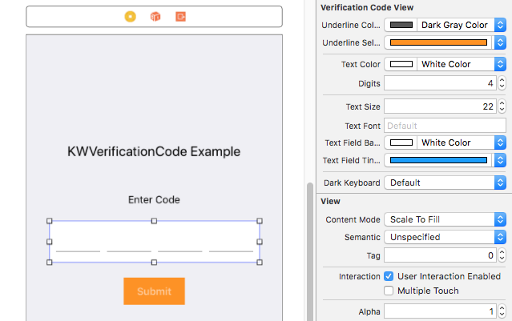

# KWVerificationCodeView

[](https://www.bitrise.io/app/df05a5313a9741ef)
[](http://cocoapods.org/pods/KWVerificationCodeView)
[](http://cocoapods.org/pods/KWVerificationCodeView)
[](http://cocoapods.org/pods/KWVerificationCodeView)

A customisable verification code view with built in validation. Can be used for one time passwords (OTPs), email verification codes etc.


## Example

To run the example project, clone the repo, and run `pod install` from the Example directory first.

## Requirements
- iOS 8 or later
- Swift 3.2

## Installation

KWVerificationCodeView is available through [CocoaPods](http://cocoapods.org). To install
it, simply add the following line to your Podfile:

```ruby
pod "KWVerificationCodeView"
```
## Usage

Add a `UIView` in your *Storyboard* and change the class to `KWVerificationCodeView`. You can set the properties in the *Attributes Inspector* and see a live preview:



The properties which can be directly set in the *Attributes Inspector* and their default values are as follows:

- `Underline Color` - Dark Gray Color

- `Underline Selected Color` - Black Color

- `Text Color` - Dark Text Color

- `Digits` - 4

- `Text Size` - 24.0

- `Text Font` - System Font

- `Text Field Background Color` - Clear Color

- `Text Field Tint Color` - Blue Color

- `Dark Keyboard` - Default Keyboard Appearance

### Variables

The `KWVerificationCodeView` has the following variables:

    isTappable: Bool

Makes the KWVerficationCodeView tappable. Default value is `false`

### Methods

The `KWVerificationCodeView` has the following methods:

	hasValidCode() -> Bool

Returns true when the entered code is valid.

	getVerificationCode() -> String

Returns the validation code.

### Protocols

#### KWVerificationCodeViewDelegate

KWVerificationCodeViewDelegate protocol has the following method:

	didChangeVerificationCode()

Notifies that the text in `KWVerificationCodeView` has been changed. This is especially useful in situations where you have to enable the submit button only if the verification code is valid.

## Author

KeepWorks, ios@keepworks.com

## Credits

KWVerificationCodeView is owned and maintained by [KeepWorks](http://www.keepworks.com/).

[](http://www.keepworks.com/)

## Contributing

Bug reports and pull requests are welcome on GitHub at https://github.com/keepworks/KWVerificationCodeView.

## License

KWVerificationCodeView is available under the [MIT License](http://opensource.org/licenses/MIT). See the [License](https://github.com/keepworks/KWVerificationCodeView/blob/master/LICENSE) file for more info.
